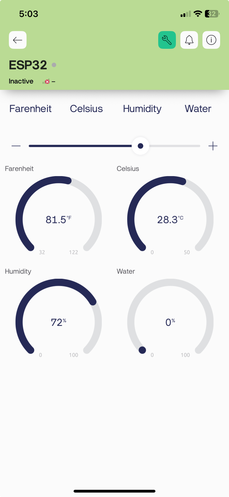

# 🌿 SensorStack: ESP32 Environmental Monitoring System with Blynk

  

**SensorStack** is a real-time environmental monitoring system that measures **temperature**, **humidity**, and **water level** using an **ESP32**, **DHT22 sensor**, and **analog water level sensor**. Data is displayed on a **16x2 I2C LCD** and sent to a **Blynk dashboard** for remote access. This project is perfect for **smart agriculture**, **environmental monitoring**, and **low-cost water systems**.

---

## 📱 Blynk Mobile Dashboard

  

---

## 📦 Introduction

This project monitors environmental parameters and displays them locally and remotely:
- **DHT22** measures temperature and humidity
- **Analog water level sensor** gauges water availability
- **16x2 I2C LCD** shows real-time data
- **Blynk** mobile app enables remote monitoring and control via Wi-Fi

---

## 🚀 Getting Started

### ✅ Prerequisites
- Basic knowledge of Arduino and electronics
- ESP32 board setup in Arduino IDE
- A Blynk account and the Blynk mobile app
- Arduino IDE installed: [https://www.arduino.cc/en/software](https://www.arduino.cc/en/software)

---

## 🔌 Hardware Setup

### 🧰 Components Required
- ESP32 microcontroller
- DHT22 sensor
- Analog water level sensor (e.g., 3361P-502GLF)
- 16x2 I2C LCD display
- Jumper wires
- Breadboard or soldered prototype
- USB cable or power supply

### ⚡ Wiring Diagram

| Component         | Pin           | ESP32 GPIO        |
|------------------|---------------|-------------------|
| **DHT22**         | VCC           | 3.3V              |
|                  | DATA          | GPIO 4            |
|                  | GND           | GND               |
| **Water Sensor**  | Signal        | GPIO 34 (analog)  |
|                  | VCC           | 3.3V              |
|                  | GND           | GND               |
| **LCD (I2C)**     | SDA           | GPIO 21           |
|                  | SCL           | GPIO 22           |
|                  | VCC           | 5V                |
|                  | GND           | GND               |

> ⚠️ *Double-check all VCC and GND connections before powering the board.*

---

## 💻 Software Setup

### 1. Install Required Libraries
- `DHT sensor library` by Adafruit
- `Adafruit Unified Sensor`
- `LiquidCrystal_I2C`
- `Blynk` (Install Blynk Library v1.x for legacy or Blynk IoT Library for new platform)

### 2. Install the Blynk App
- Download from the [App Store](https://apps.apple.com/) or [Google Play](https://play.google.com/)
- Create a new project
- Choose **ESP32** as the board
- Add widgets:
  - **Value Displays** for Temp (°C/°F), Humidity, and Water Level
  - **Menu widget** or buttons to change LCD display modes (optional)
- Copy the **Auth Token** from the app

### 3. Code Setup
- Paste the Auth Token in your sketch
- Replace Wi-Fi SSID and password
- Use `Blynk.virtualWrite(Vx, value)` to send data to your widgets
- Upload the code using Arduino IDE

---

## 📊 Usage Instructions

### LCD Display Modes

| Mode | Description               |
|------|---------------------------|
| 1    | Temperature in °F         |
| 2    | Temperature in °C         |
| 3    | Humidity (%)              |
| 4    | Water Level (%)           |

Use a **Blynk menu widget** or **buttons** to change modes remotely. The display updates every 2 seconds.

---

## ☁️ Remote Monitoring via Blynk

With Blynk, you can:
- See real-time values on your smartphone
- Control which value is displayed on the LCD
- Set alerts for abnormal temperature/humidity or low water levels

---

## 🛠️ Troubleshooting

| Issue                        | Likely Cause                       | Fix                                         |
|-----------------------------|------------------------------------|----------------------------------------------|
| LCD not displaying text     | Wrong I2C address or bad wiring    | Try `0x3F` instead of `0x27`; check VCC/GND  |
| No sensor values shown      | Sensor not initialized or miswired | Check `Serial Monitor` for errors            |
| Blynk not connecting        | Wrong Auth Token or Wi-Fi issue    | Double-check credentials and signal strength |
| Water level stuck at 0/100%| Dry test or poor calibration       | Use real water; avoid testing with fingers   |

---

## 🧼 Maintenance

- Keep sensors clean and dust-free
- Ensure waterproofing for water sensor
- Restart ESP32 occasionally for Wi-Fi stability
- Secure all breadboard/jumper connections

---

## 🛡️ Warranty & Support

This is an open-source DIY project and comes with no official hardware warranty. However, help is available from:

- [Blynk Community](https://community.blynk.cc/)
- [Arduino Forum](https://forum.arduino.cc/)
- [Stack Overflow](https://stackoverflow.com/questions/tagged/esp32)
- [Espressif ESP32 Docs](https://docs.espressif.com/)

---

## 🧠 License

This project is open-source and for educational use. Feel free to modify or extend it.